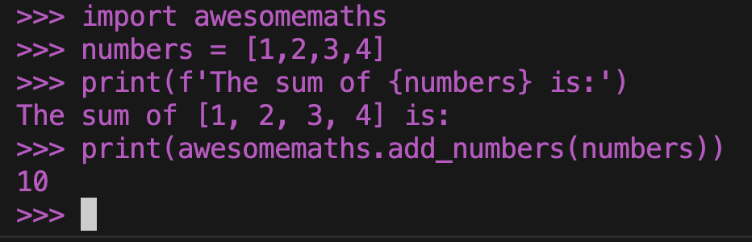
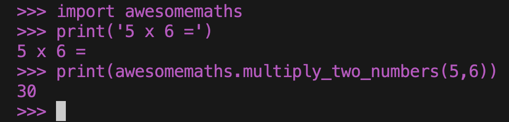

+++
title = 'So What is an API'
date = 2023-10-20T15:25:08+01:00
draft = true
+++

This post is one for the beginners; those early in their journey through the Tech industry or who are simply interested in the topic. I'll not be going into too much detail but will include some code examples to illustrate some concepts, specifically in Python as it is considered a highly readable langauge. If you know nothing about coding though, don't worry, I'll be keeping the examples simple and will include explanations of the key parts of the code so nobody gets lost. I hope to create a long running series of posts similar to this, aimed at beginners/newcomers to tech or specific technologies, intending to demystify the various concepts, terminology and gratuitous acronyms thrown about by those 'in-the-know'. Look out for more posts coming soon!

## What is an API then?

If you're reading this, you've presumably heard the term API banded about but not been quite sure what this meant? Early in my career, when I worked in IT support, before I ever looked at code in any professional sense or worked with 'systems', software or Platforms, the term would have seemed distinctly _vague_ to me. Often used in seemingly different contexts, lacking clarity in meaning and often with a very buzzwordy feel to it.

So let's just go out and define it to begin with.


> _"API stands for Application Programming Interface. In the context of APIs, the word Application refers to any software with a distinct function. Interface can be thought of as a contract of service between two applications. This contract defines how the two communicate with each other using requests and responses."_ - Amazon Web Services.

The above quote from AWS does a good job defining the term in relatively plain English, especially the first half of it. The last sentence hints more towards a specific kind of API which we'll get into later but overall this is the core definition we'll be basing the rest of this post on.

But for many of you, this is likely still going to be a little abstract or confusing, depending on your level of experience working with software systems or with this type of industry language.

Crucially, I have found in my experience that this term is often used to mean one of two specific catagories of API, often with the assumption that the listener/reader simply knows from context which is being referred to.

Here I need to introduce the idea of 'REST APIs'(and other HTTP based API standards) as well as software library APIs, but more details will follow. For now though, just know that often when people refer to an 'API', what they really mean is a 'REST API', but other times they may mean a software library's API. Really, there is a hierarchy of definitions here, where the term API has its general definition (the AWS definition above), and more context specific definitions exist underneath this, such as RESTful APIs. The problem is people tend to use the term API synonimously to mean any of the above which is where confusion can originate. 

It's sort of like how Americans tend to call _all_ insects 'bugs' but in reality, 'bugs' are a specific order of insect called 'hemipteran'. 

> _'The formation of the mouthparts into the elongated rostrum is unique to the Hemiptera and is not found even in other groups with sucking mouthparts.'_ - [Royal Entomological Society](https://www.royensoc.co.uk/understanding-insects/classification-of-insects/hemiptera/) 

Beetles are yet another order, _coleoptera_. All Beetles are insects, but no beetles are bugs... Note, there are also differences colloquially between different English language speakers too, for example people in the UK use the term bug less often to describe all insects than North Americans do, to add to confusion. Why am I talking about invertabrites so much? I think this perfectly illustrates the problem I am really getting at - language is _hard_ and cultivating shared meaning is even harder. That's why I'm writing this post, to help those going to a bug convention not slip up and mention anythig about [_chewing mouthparts_](https://www.woodlandtrust.org.uk/blog/2023/06/difference-between-bugs-and-beetles/)

But back to APIs, REST APIs are APIs, software library APIs are also APIs but the two are different from each other and exist in different contexts. Often people talking about one of these contexts may use the term API to explain something but what they are actually talking about is something related more to the specific type of API they're using, such as something related to the HTTP protocol.


## Software Library API

Depending on your experience or what area you work in, you may or _may not_ have much exposure to this category of API. In my career this category was introduced to me later than REST APIs and so caused some initial confusion when hearing the term.

A software library's API acts as an abstraction between the internal workings of the software library and the _consumer_ of the library. What I mean by this is it's the contract (remember our core definition) between how the software library authors and those who use it in a wider software project, regardless of how the software library implements its functionality. 

Let's take the analogy of a restaurant or cafe - you, the consumer, know how to be a customer. You go in, ask to be seated at a table, a waitor comes to ask you what you would like to drink, eat, your preferences (i.e. rare, medium...) and they then bring this information to the back of house. You don't see what goes on behind there. You don't need to know what temperature your steak is fried at. Youd don't need to know what order the food is cooked in or the name of the chefs. You don't need to know where the pots and pans are kept. You just wait and then receive your food. 

You can also easily eat at this restaurant after they complete a major renovation of their kitchens. This doesn't change how you interact with the resaurant or the servers etc, but the food might be produced in a different way now, perhaps more efficiently wasting fewer resources such as water and energy.


To give a more technical example, we'll take a look at some code. The topic of designing, writing, packaging software libraries / modules / packages is vast and complex so we'll be keeping this example simple and far from best practice, so forgive the simplicity if you do have experience writing code, it is necessary to keep this accessible. It is also going to be a rather arbitrary example to keep it simple and focus on the key points.

Let's say we're the maintainers of a software library for performing mathematical calculations. We've defined a large range of functions available publically to the consumers of the library, backed up by some internal functions not intended to be seen by the user. The consumer doesn't need to know the inner workings of our functions, they just need to trust the described behaviour will always happen when using the public functions. They also need to know that what we change behind the scenes won't make their code which uses our library break if they update the versions. Note, this code is also intentionally obtuse so don't worry if it doesn't make sense - this would not be a _good_ library!


```python
#awesomemaths.py

# private function, not for users!
def _add_two_numbers(a, b):
    return a + b

def add_numbers(list_of_numbers):
    running_total = 0
    for i in range(0,len(list_of_numbers),2):
        running_total += _add_two_numbers(list_of_numbers[i],list_of_numbers[i+1])
    return running_total

def multiply_two_numbers(a, b):
    running_total = 0
    for i in range(a):
        running_total += b

def divide_x_by_y(x,y):
    ...
```

Our python file contains numerous functions, some of which are intended to be used by our consumers, some of which aren't. For example, `_add_two_numbers` is not intended to be used directly, instead, the consumer will pass a list of numbers to `add_numbers` to sum any quantity of numbers together.

> In Python, `_` before variable, function or method names indicates a private item by convention. It doesn't actually have any functional behaviour, it is purely convention - controlling what is and isn't importable from the module is done via a different mechanism but it is useful to use the convention to make collaboration easier between developers.

How we enforce the intended use (the API) of our library varies from language to language and between different coding practices and patterns. In Python, we define what can be imported via the `import` statement using the `__init__.py` file but I'll not go into detail here as it is out of scope of the post. There is much less standardisation here than with the likes of REST APIs, which are language agnostic. We'll discuss them later. In our example, we're simply providing only our 'public' functions to the import feature of Python and we are only providing information about these functions in our library documentation.

```#README.md
Welcome to the awesomemaths library. We provide the best calculations around with easy to understand usage. See our API documentation below:

- add_numbers(a, b) -> function to add a list of numbers. This function expects a list of integers and returns their sum.

- multiply_numbers(a, b) -> function to multiply two numbers together. This function expects two integers and returns their product.

...
```

Notice how our 'docs' don't mention the `_add_two_numbers` function - this is an implementation specific function and the consumer shouldn't be using it!


    Now let's switch hats, we're the user of this library and we're building a calculator app using some GUI framework for our given platform, but first, we're testing out the library just by 'printing' some calculations to make sure we know how to use it.

We have read 'the docs' and know that we can use the `add_numbers` function to get the sum of a list of numbers, which we think will be useful in our calculator.

We test this with the following code.

```python
import awesomemaths

numbers = [1,2,3,4]
print(f'The sum of {numbers} is:')
print(awsomemaths.add_numbers(numbers))
```



Now, asside from being generally terrible and unsafe code (which we as the library user haven't seen anyway), there is an explicit bug in the library we are using, which we will now find out by running `awsomemaths.add_numbers([1,2,3,4,5])`. This results in the error `IndexError: list index out of range`, but the error isn't from our calculator code but rather in the library itself - we are not responsible for fixing it! Bonus points if you know what the bug is.

Being good digital citezens however, we report the bug and give the team at awesomemaths the benefit of the doubt.

We move on (you could argue foolishly) to investigate another one of the public functions of the library, `multiply_two_numbers`.

This function takes in two numbers and returns their product. How this is achieved is not important to us, we just expect it to work (ideally without bugs this time!).

We could call it from our code like this:

```python
import awesomemaths

print('5 x 6 =')
print(awesomemaths.multiply_two_numbers(5,6))
...
```

As we expect, this does indeed print the correct value, 30.



We don't need to know how this multiplication is implemented. If you look at the 'library' code, you see it actually performs multiplication solely with addition inside a loop. Essentially, it takes a running total starting at 0 and adds number 'b' to it for each step in the loop. The loop runs for 'a' steps. A strange way to perform multiplication in a high level language for sure, but not our problem. Perhaps in our imaginary world, doing it this way is faster and we're outsourcing the performance tuning to the library maintainers. (This is obviously not true of course but work with me!)

This is one of the key purposes of defining an API. The maintainers of the library can change _how_ they implement `multiply_two_numbers` at any time without breaking our code which calls it, they just have to make sure that when we use their function, 5 x 6 = 30, or 20 x 4 = 80 etc. This allows them to improve their functionality, perhaps increasing performance via new implementations without their consumers needing to make any changes to their code.

Now, in the background, awesomemaths have been working very hard to fix the bug in the `add_numbers` function. They also want you to know that they're very sorry for _breaking_ their public API, they promise it won't happen again.

They've realised that their implementation didn't account for lists with _odd_ numbers of values in them, causing the index out of range error. They began modifying their code to handle the scenario but whilst doing so, realised a better way to implement the feature. Instead of iterating through the list of numbers in steps of 2, adding the numbers in the list at the index of the step, and the step-plus-one using the internal _add_two_numbers function (don't worry if that doesn't make sense, it was intentionally obtuse), they could instead iterate through the list of numbers and simply add each to a running total, so that's what they did. They no longer need to use _add_two_nunbers and if they don't use it anywhere else in their code, they could safely remove this function completely from the library. As the user is never able to call this function directly, they'll not need to change their code after _add_two_numbers is deleted.

The users don't even need to see any of that, in the library's release communications they simply state:

`Release 1.3.32 - bug fix in add_numbers function to fix an issue when adding odd sized lists of numbers...`

They don't go into the implementation details because we (the consumers) don't care!

In the same release, they might have changed the implementation of multiply_two_numbers to improve performance. We don't need to understand how but we get the benefits for free!

Going forward, we hope awesomemaths keep up the good work, introduce no further bugs but _more importantly_ introduce no functionality that requires we change _our_ code.


## HTTP based API e.g. REST


Now, potentially more often these days, when people are casually talking about 'APIs', they are talking about REST APIs or other web based APIs. Within this, there are a range of specifications for such web APIs, but REST is the most well known standard so we'll mainly discuss it here.

The crucial difference here is instead of talking about two pieces of software talking to each other directly, on the same compute resource, here, one system talks to another over a network.

This obviously introduces an entirely different context in which to think about this _'contract'_ between our software systems. This is where I find talk about these types of 'APIs' often bleeds into other concepts and meanings more related to HTTP or networking for example.

> 'A REST API is an API that conforms to the design principles of the REST, or representational state transfer architectural style.' - [IBM](https://www.google.com/url?sa=t&rct=j&q=&esrc=s&source=web&cd=&ved=2ahUKEwi6ut6vrNuDAxXxU0EAHa-ABeAQFnoECBwQAw&url=https%3A%2F%2Fwww.ibm.com%2Ftopics%2Frest-apis%23%3A~%3Atext%3Dthe%2520next%2520step-%2CWhat%2520is%2520a%2520REST%2520API%253F%2Crepresentational%2520state%2520transfer%2520architectural%2520style.&usg=AOvVaw0RvExLMZRbZvSAMnz1xJ9-&opi=89978449)

